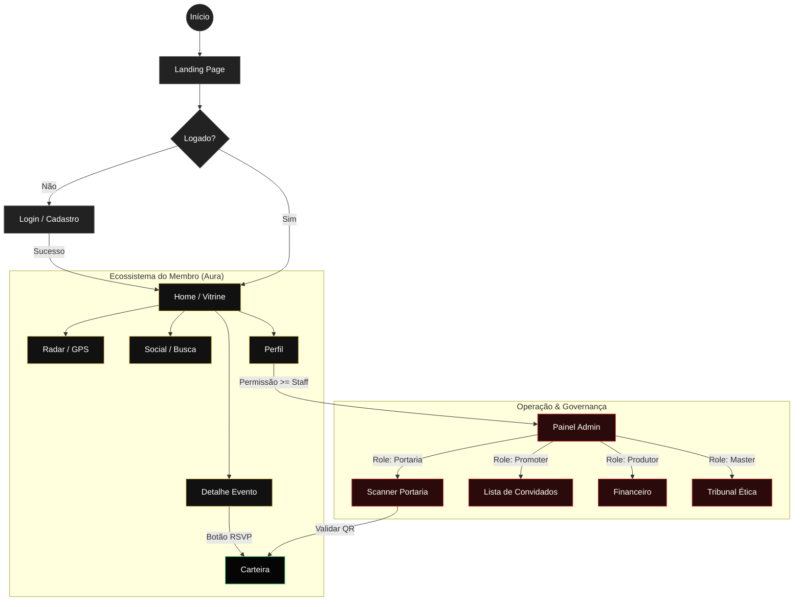

# VANTA | Protocolo de Governança [VANTA_SYNC]

Este documento serve como a **Constituição do Projeto**, estabelecendo os limites técnicos e operacionais para a inteligência artificial e desenvolvedores. Nenhuma alteração de lógica central pode violar estes princípios sem autorização expressa do Membro.

## 🛡️ Princípios Gerais VANTAADMIN

1.  **Permissões Granulares**: O sistema opera baseado em permissões técnicas específicas, não em cargos genéricos. O acesso a funções é binário e verificado por contexto.
2.  **Visibilidade por Contexto (Bonding)**: A interface é filtrada dinamicamente. Se um usuário não possui vínculo explícito com uma Unidade (Comunidade) ou Evento, os dados são invisíveis e inacessíveis no nível de API/Estado.
3.  **Soberania Master**: Os perfis de nível Master detêm a única autoridade global, com capacidade de visão cross-platform e gestão de infraestrutura de unidades.
4.  **Blindagem de Dados**: Dados financeiros, métricas de performance sensíveis e curadoria de membros são protegidos por camadas de "Zero Visualização" até que a permissão de escopo seja validada.
5.  **Rastreabilidade Absoluta (Logs)**: Toda e qualquer mutação de estado administrativa (aprovação, criação, edição, delegação) gera obrigatoriamente um registro de Auditoria (Audit Log) com carimbo de tempo e identificação.

---

## ❄️ Estado de Congelamento (FROZEN STATE)

As seguintes estruturas estão em modo **READ-ONLY** e não podem ser alteradas sem o comando `[VANTA_SYNC]` seguido de autorização por escrito:
*   Estrutura de Comunidades e Unidades (Boate vs Produtora).
*   Lógica de Herança de Endereço Fixo para Locais.
*   Hierarquia de Permissões (Master, Produtor, Sócio, Promoter, Portaria).

---

## 🚀 Como Rodar Localmente

**Prerequisites:** Node.js

1.  Instale as dependências: `npm install`
2.  Configure a `GEMINI_API_KEY` em [.env.local](.env.local)
3.  Inicie o servidor: `npm run dev`

View your app in AI Studio: https://ai.studio/apps/drive/16H4pjuxUrCXOLVaNg7cHizU2A94N35uI

---

## 📊 7. Representação Visual (Live Architecture)

Esta seção documenta a matriz de acesso e o fluxo de navegação implementados no sistema.

### 7.1 Matriz de Permissões Soberana
| Funcionalidade | Visitante | Membro (User) | Staff / Promoter | Portaria | Produtor (Dono) | Master (Admin) |
| :--- | :---: | :---: | :---: | :---: | :---: | :---: |
| **Visualizar Eventos** | ✅ | ✅ | ✅ | ✅ | ✅ | ✅ |
| **RSVP / Comprar** | ❌ (Gate) | ✅ | ✅ | ✅ | ✅ | ✅ |
| **Carteira / QR** | ❌ | ✅ | ✅ | ✅ | ✅ | ✅ |
| **Transferir (Gift)** | ❌ | ✅ | ✅ | ❌ | ✅ | ✅ |
| **Perfil / Social** | ❌ | ✅ | ✅ | ✅ | ✅ | ✅ |
| **Admin Panel** | ❌ | ❌ | ✅ (Limitado) | ✅ (Scanner) | ✅ (Unidade) | ✅ (Global) |
| **Gerir Lista** | ❌ | ❌ | ✅ (Própria) | ✅ (Check-in) | ✅ (Total) | ✅ (Total) |
| **Financeiro** | ❌ | ❌ | ❌ | ❌ | ✅ (Próprio) | ✅ (Global) |
| **Banir Membros** | ❌ | ❌ | ❌ | ❌ | ❌ | ✅ |

### 7.2 Fluxo de Navegação (Mermaid)
